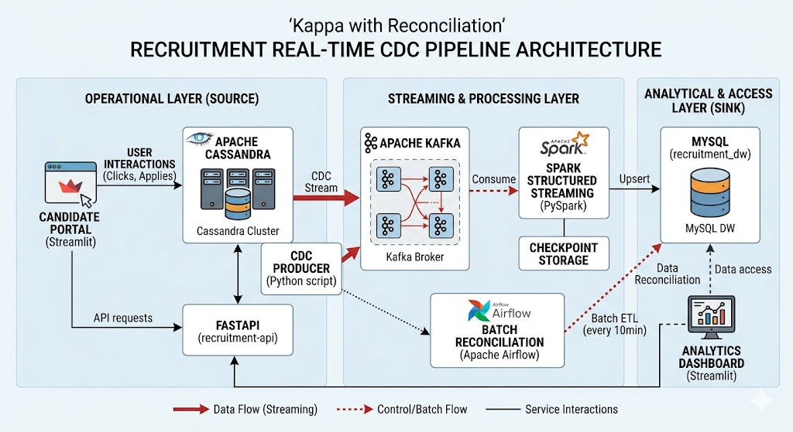
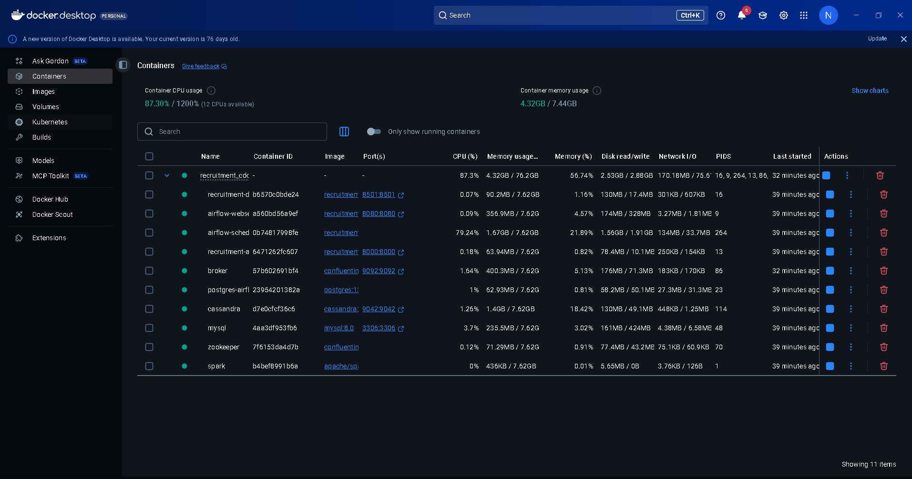
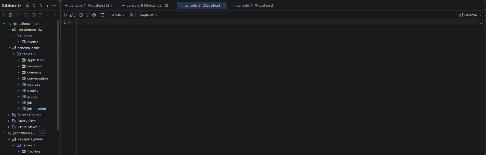
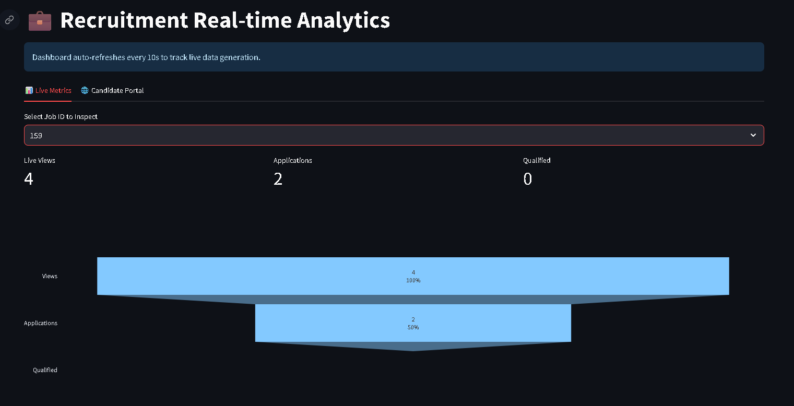
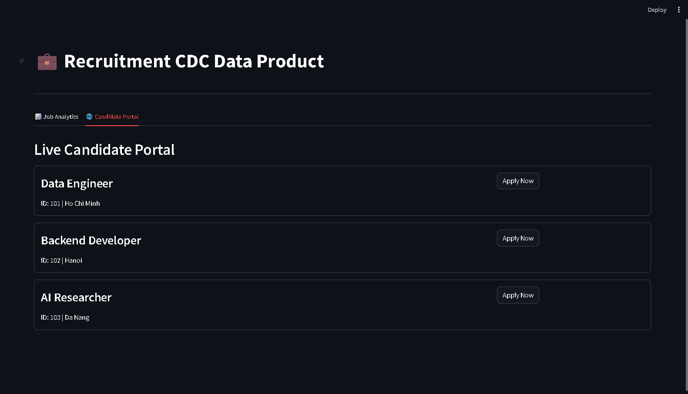
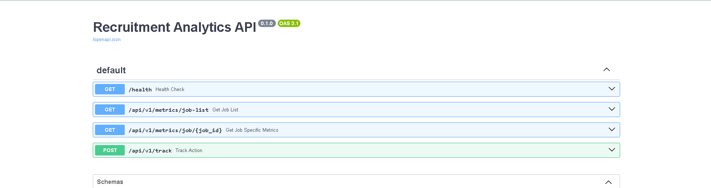
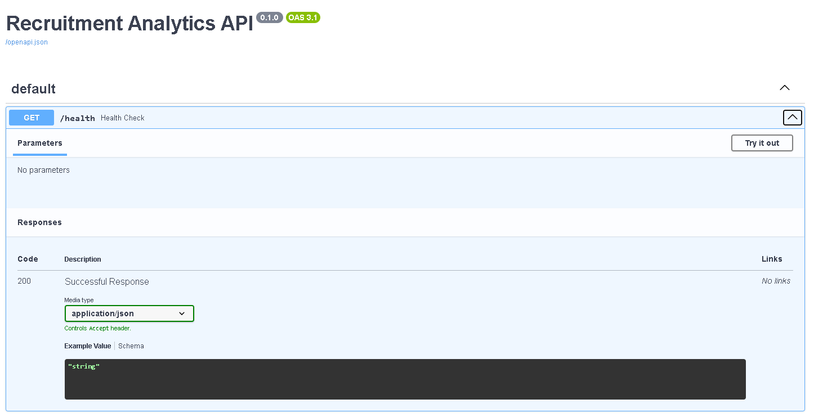
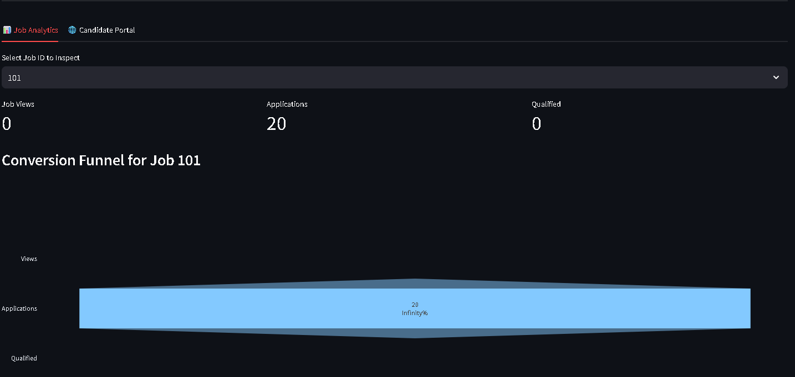
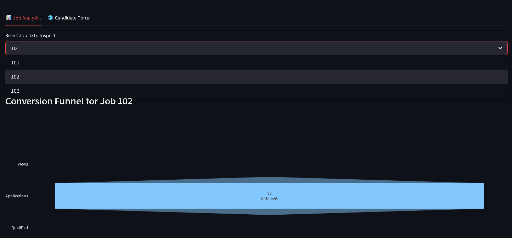

# Recruitment Real-time CDC Pipeline 

[](https://en.wikipedia.org/wiki/Six_Sigma)
[](https://opensource.org/licenses/MIT)
[](https://github.com/nguyenkhang-1902)
[](https://kafka.apache.org/)
[](https://spark.apache.org/)
[](https://airflow.apache.org/)
[](https://www.docker.com/)
[](https://fastapi.tiangolo.com/)

## 📌 Project Overview

### 📈 Business Case & Problem Statement
In modern recruitment, the "Time-to-Data" gap often leads to missed opportunities. Traditional ETL processes rely on daily batches, causing a **24-hour delay** in understanding candidate behavior. This latency results in:
* **Information Asymmetry:** Recruiters cannot see live application trends.
* **Data Silos:** Lack of synchronization between high-speed user interactions and the analytical warehouse.
* **Process Inefficiency:** Inability to detect bottlenecks in the recruitment funnel (e.g., high views but zero applications) until it's too late.

### 🎯 Six Sigma Goals
The project aims to achieve **"Lean Data Excellence"** by implementing a Real-time CDC Pipeline:
* **Reducing Data Latency:** From **24 hours** to **< 30 seconds**.
* **Data Accuracy:** Maintaining **99.9% consistency** between operational (Cassandra) and analytical (MySQL) sources.
* **Operational Control:** Automating 100% of the data flow to eliminate manual reporting errors.

### 🛠 The DMAIC Framework
* **Define:** Standardize candidate experience tracking and data integrity for every "Job Interaction" event.
* **Measure:** Implement **Change Data Capture (CDC)** to monitor Cassandra source changes. Measured by event throughput and system uptime.
* **Analyze:** Use **Spark Structured Streaming** to join real-time streams with historical job dimensions, identifying conversion bottlenecks in the funnel.
* **Improve:** Optimize performance via Kafka partitioning and Spark parallel processing, achieving a processing latency of **~10-20 seconds** per event.
* **Control:** Ensure long-term stability with **Batch Reconciliation (every 10 minutes)** to fix drift and **Checkpointing** for fault tolerance. Visual control via a real-time **Streamlit Dashboard**.

---
## 📁 Project Structure 

```plaintext
recruitment-cdc-pipeline/
├── datapipeline/
│   ├── airflow/                 
│   │   ├── dags/                
│   │   │   ├── dag_batch_processing_10min.py
│   │   │   └── dag_continuous_services.py
│   │   └── logs/                
│   ├── app/                     
│   │   ├── backend/             
│   │   │   ├── main.py
│   │   │   ├── database.py
│   │   │   └── Dockerfile
│   │   ├── frontend/            
│   │   │   ├── dashboard.py
│   │   │   └── Dockerfile
│   │   └── requirements.txt     
├── dataset/                     
│   ├── MySQL/                   
│   └── Cassandra/               
├── scripts/                     
│   ├── ingestion/               
│   │   ├── kafka_cdc_producer.py
│   │   └── data_generator.py    
│   ├── processing/              
│   │   ├── checkpoints/         
│   │   ├── stream_etl_kafka_to_mysql.py
│   │   └── batch_etl_cassandra_to_mysql.py
│   └── shared/                  
├── docker-compose.yml           
├── Dockerfile                   
├── .gitignore                   
└── README.md                    
```
``

---
### 🛠 Tech Stack

| Layer               | Technology                               | Purpose                                             |
|---------------------|------------------------------------------|-----------------------------------------------------|
| **Source Database** | **Apache Cassandra** | High-write throughput storage for user interactions |
| **Ingestion (CDC)** | **Python & Kafka Producer** | Change Data Capture to stream events from Cassandra |
| **Message Broker** | **Apache Kafka** | Real-time distributed event streaming platform       |
| **Stream Processing**| **Apache Spark Structured Streaming** | Real-time ETL, Joining, and Aggregation             |
| **Data Warehouse** | **MySQL** | Analytical storage for aggregated metrics           |
| **Orchestration** | **Apache Airflow** | Pipeline scheduling and service monitoring          |
| **API & Backend** | **FastAPI** | Serving real-time metrics and tracking endpoints    |
| **Visualization** | **Streamlit** | Real-time Dashboard & Candidate Portal              |
| **Infrastructure** | **Docker & Docker Compose** | Containerization and full-stack orchestration       |
---

### 🏗 System Architecture

The architecture follows the **Kappa Architecture** principle, focusing on real-time stream processing with a batch layer for reconciliation.


#### 1. Real-time Flow (CDC Pipeline)
* **User Interaction:** Candidate clicks/applies on the **Streamlit Portal**.
* **Event Capture:** **FastAPI** receives the request and writes to **Cassandra**.
* **CDC Logic:** A dedicated **Python Producer** polls Cassandra for new records and pushes them to **Kafka** topics.
* **Processing:** **Spark Structured Streaming** consumes events from Kafka, joins them with Job dimensions from **MySQL**, and performs real-time aggregations.
* **Sink:** Processed metrics are "upserted" back into **MySQL** Warehouse.

#### 2. Batch Reconciliation (Control Layer)
* An **Airflow DAG** triggers a **PySpark Batch** job every **10 minutes**.
* It performs a full sync between Cassandra and MySQL to ensure **99.9% data consistency**, correcting any drifts from the streaming layer.

#### 3. Data Product Layer
* The **Streamlit Dashboard** fetches live data from the **FastAPI** endpoints to visualize the recruitment funnel and job-specific metrics.

-----

### 📋 Prerequisites

Before launching, ensure your system meets the following requirements to guarantee stable operation (especially since Spark and Cassandra are resource-intensive):

  * **Software:**
      * Docker & Docker Compose installed.
      * Git (to clone the project).
  * **Minimum Hardware Configuration:**
      * **RAM:** 8GB ( **16GB Recommended** to prevent container freezing/OOM issues).
      * **CPU:** Minimum 4 Cores.
      * **Free Disk Space:** \~5GB.
  * **Docker Desktop Configuration:** Ensure you have allocated at least **8GB of RAM** to Docker in the *Settings \> Resources* section.

-----

### 🚀 Getting Started

The project supports two operational modes depending on your testing objectives:

-----

#### 🔹 Step 1: Spin up Docker Infrastructure

Before proceeding with any specific mode, you must deploy the entire ecosystem, including Cassandra, MySQL, Kafka, Spark, Airflow, and FastAPI.

From the project root directory, run:

```bash
docker-compose up -d --build
```

Verify the status of all containers:

```bash
docker ps
```

> **Note:** Ensure all services (`recruitment-api`, `recruitment-dashboard`, `cassandra`, `mysql`, `broker`, `airflow-scheduler`) are in the **Up** (Healthy) state.


-----

#### 🔹 Step 2: Seed Initial Data

The project includes a sample dataset to define **Dimensions** in MySQL, which are essential for performing Join operations within the Spark engine.

1.  **Access the MySQL container:**
    ```bash
    docker exec -it mysql mysql -u root -p123456
    ```
2.  **Initialize Schema and Data:**
    Execute the provided SQL files to create tables and populate data for: `application`, `campaign`, `company`, `conversation`, `dev_user`, `events`, `group`, `job`, and `job_location`.



---
#### 🔹 Step 3: Choose Your Operational Path

### 🛣️ Path 1: Automated Data Simulation
This approach utilizes the `data_generator.py` script to automatically generate thousands of random records. It is designed to stress-test the pipeline's throughput and verify the end-to-end flow without manual intervention.

1. **Activate the Airflow DAG:**
   - Access the Airflow UI at: `http://localhost:8080` (Default: admin/admin).
   - Locate and **Unpause** the DAG: `1_continuous_services_pipeline`.
2. **Operational Mechanism:**
   - The `service_data_generator` task will continuously ingest simulated events into the Cassandra `tracking` table.
   - The CDC engine and Spark Streaming job will automatically capture these events and sink them into the MySQL Warehouse.
3. **Verify via Dashboard:**
   - Open the Streamlit Dashboard at: `localhost:8501`.
   - Navigate to the **Analytics Dashboard** tab; you will observe the metrics increasing incrementally after each Spark processing cycle (every 30 seconds).



---
#### 📊 Data Flow Monitoring
To accurately track the data volume flowing through each infrastructure layer, use the following Terminal commands:

* **Source Database Check (Cassandra):**
    ```bash
    docker exec -it cassandra cqlsh -e "SELECT COUNT(*) FROM keyspace_name.tracking;"
    ```
    > **Expected Result:** Returns the total number of raw records ingested. This figure serves as the **"Source-of-truth"** for reconciliation with downstream layers.

* **Message Broker Check (Kafka):**
    ```bash
    docker exec -it broker kafka-run-class kafka.tools.GetOffsetShell --broker-list localhost:29092 --topic tracking_events
    ```
    > **Expected Result:** The message count (offsets) in Kafka should match or closely approximate the Cassandra count. If this number remains static while Cassandra grows, investigate the CDC Producer.

* **Data Warehouse Check (MySQL):**
    ```bash
    docker exec -it mysql mysql -u root -proot -e "SELECT SUM(clicks) + SUM(conversion) FROM recruitment_dw.events;"
    ```
    > **Expected Result:** The aggregated record count in MySQL should converge toward the Kafka count (with a ~30s latency due to Spark micro-batch intervals). Steady growth here confirms full system synchronization.
---

### 🛣️ Path 2: Real-world Interaction
Once the pipeline flow is verified in Path 1, switch to this mode to experience the project as a live product where data is triggered solely by user behavior.

1. **Stop Simulation Task:**
   - In the Airflow UI, **Pause** the `service_data_generator` task to clear the stream of test data.
2. **Engage with the Candidate Portal:**
   - Access the Streamlit Dashboard at: `http://localhost:8501`.
   - Switch to the **"Candidate Portal"** tab.
   - Interact by clicking **"Apply Now"** or **"View Job"** on various job postings (e.g., Job IDs: 101, 102, 103).
3. **Observe the Real-time CDC Pipeline:**
   - Each click sends a request to **FastAPI** (`recruitment-api`).
   - Flow: FastAPI writes to Cassandra → Triggers CDC Producer → Pushes to Kafka → Spark Streaming processes the event.
4. **Dashboard Reflection:**
   - Return to the **"Analytics Dashboard"** tab. The Conversion Funnel will update to reflect your specific actions with a latency of < 30 seconds.
5. **Periodic Reconciliation (Batch Layer):**
   - Enable the DAG `2_batch_etl_every_10min`. This triggers a routine scan to synchronize Cassandra and MySQL every 10 minutes, ensuring **99.9% data consistency** and correcting any potential streaming anomalies.



   ---

### 📊 Data Validation

#### 📡 API Documentation

The system leverages **FastAPI** to automatically generate comprehensive API documentation. This interface allows for rapid testing of endpoints and system connectivity without the need for manual database queries.

* **Access URL:** `http://localhost:8000/docs`

**Endpoints Overview:**
The Swagger UI provides a complete visualization of all data flows, ranging from system health checks to analytical data retrieval.


**Health Check Verification:**
Use the `/health` endpoint to confirm that the Backend has successfully established a connection with the Cassandra cluster.



---

#### 🗄️ Direct Query & Data Reconciliation

Beyond the API, you can perform manual data reconciliation by querying both ends of the pipeline directly:

**Verify Source Data (Cassandra):**
Confirm that user interaction data from the portal has been persisted.

```sql
-- Validate that the interaction record exists in the source
SELECT * FROM keyspace_name.tracking WHERE job_id = 101 ALLOW FILTERING;
```

**Verify Sink Data (MySQL Warehouse):**
Confirm that the final aggregated results have been successfully processed by Spark Streaming and stored in the warehouse.

```sql
-- Validate the final output processed via the Streaming layer
SELECT * FROM recruitment_dw.events WHERE sources = 'Kafka_Streaming' ORDER BY updated_at DESC;
```

-----

### 📊 Dashboard Summary

The final layer of the pipeline is a complete **Data Product**, enabling data-driven recruitment decisions based on real-time evidence rather than intuition.



#### ✨ Key Features Delivered:

  * **Real-time Insights:** Metrics for Views, Applications, and Qualified candidates are updated with sub-30s latency.
  * **Drill-down Capability:** Enables granular filtering to analyze the performance of specific Job IDs.
  * **Conversion Funnel:** Visualizes the conversion rate across stages, allowing recruiters to pinpoint bottlenecks in the hiring process immediately.
  * **System Stability:** The entire stack is containerized with Docker, ensuring high availability and data recovery via **Spark Checkpointing** mechanisms.

<!-- end list -->

---

## ✍️ Author 

**Nguyen Khang** 
*Data Engineer | Big Data Enthusiast*

If you have any questions about this project, potential collaborations, or just want to talk about Data Engineering, feel free to reach out!

* **GitHub:** [@nguyenkhang-1902](https://github.com/nguyenkhang-1902)
* **LinkedIn:**  [Khang Nguyễn](https://www.linkedin.com/in/khang-nguy%E1%BB%85n-5228652a0/)
* **Email:** nguyenkhang1150@gmail.com
---